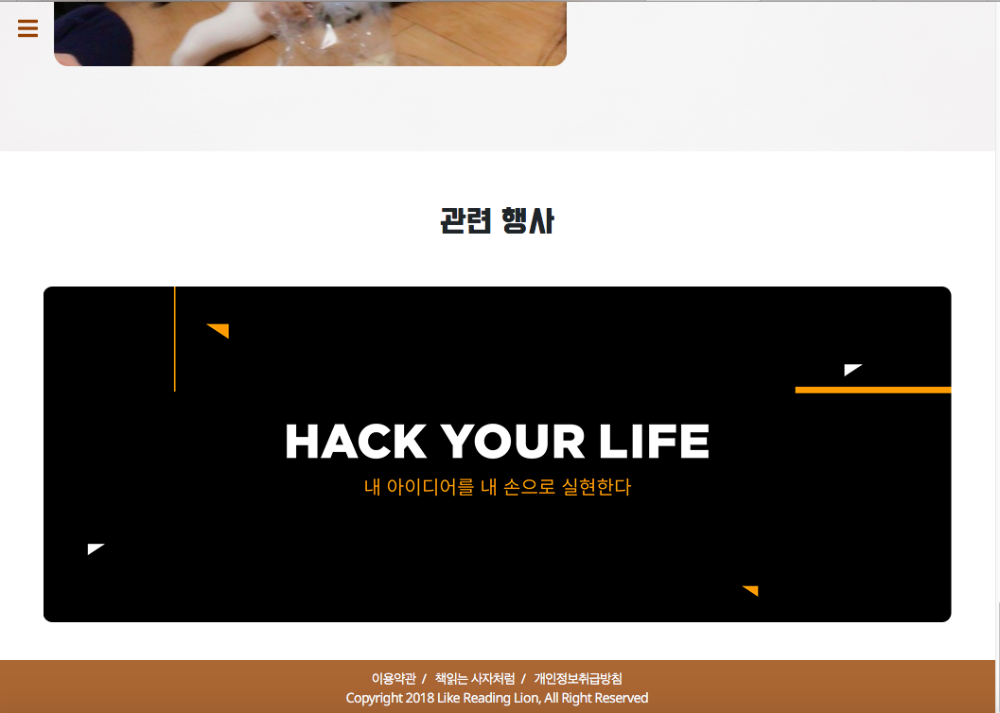

#likelion-teample
## 준혁/혜민/민석

#### 1. 구현의도
- 본 웹제작 팀프로젝트는 3인 1조로 팀을 이루어 멋쟁이 사자에서 배운 HTML,CSS 등을 적극적으로 활용하고 bootstrap 을 적극적으로 참고하여 특정 브랜드나 제품을 판매하는 웹사이트의 첫 화면을 구축하는것이다.

- 본 홈페이지 제작에서는 멋쟁이 사자처럼을 통해 성장할 우리 팀 준혁/혜민/민석 3인을 공동저자로 하여 책읽는 사자차럼 이라는 출판 브랜드를 설정하고 신간 도서를 홍보하는 페이지를 제작하였습니다.

- 기존의 상단 고정 메뉴바에서 좌측 메뉴바를 만들고 페이지 전체를 한 화면에 열거하고, 메뉴로 해당 페이지로 바로 이동할 수 있도록 < a > 를 사용하였습니다.

#### 2. 역할분담
방민석 : 홈페이지 전체 아웃라인 기획/ 내부 컨텐츠 구축
송혜민 : 홈페이지 전체 디자인 / 로고 제작/ 내부 컨텐츠 구축
전준혁 : 홈페이지 전체 틀 제작 / 내부 컨텐츠 구축

#### 3. 조원별 오류 내용 + 오류 해결방법(코드첨부)
제작간에 큰 오류는 없었으나, 좌측 메뉴의 자연스러운 생성과 사라짐 효과를 위해 jquery 를 사용하였습니다. 사용은 인터넷 서칭을 통해 그 방법을 터득하였으며 그 사이트는 아래 참고문헌에 모두 포함시켰습니다.
#### 4.간단한 소감

######방민석 
: 역시나 홈페이지 제작은 많이 어려운것 같습니다. 더군다나 팀으로 이렇게협업을 해보니 더려운 부분이 많았지만 서로서로 알려주며 도와주며 노력한 덕분에 프로젝트를 잘 마무리 할 수 있었던 것 같습니다. 모두 수고하셨습니다!

######송혜민 
: 아직도 html과 css에 대해 모르는 부분이 많아 팀프로젝트에 많은 기여를 하지 못한 것이 아쉽습니다. 그래도 협업하는 과정에서 잘 알지 못하던 지식들을 확실히 정립할 수 있었어서 뿌듯합니다. 한 단계 더 발전하는 계기가 된 것 같아 보람찬 협업 기간이었습니다! 준혁오빠, 민석오빠 두 분 다 고생 많으셨어요 :3

######전준혁
:애니메이션을 너무 넣고싶어서 생전에 듣도보도못한 jquery 소스를 복붙하면서 코딩은 마치 레고와도 같았구나 라는걸 느꼈다. 우리팀과 깃허브를 이용하여 처음으로 협업을 하면서 여러 사람들과 아이디어를 공유하고 머리를 맞대며 만들어 내는 것이 더욱 재미있고 보람찼다. 비록 대단한 작품은 아니지만 협업을통한 첫 프로젝트를 해서 정말 기뻤습니다^^ 우리팀 모두 고생 많았다!!

#### 5. 참고문헌
- https://getbootstrap.com/docs/4.0/layout/overview/
- http://grace-go.tistory.com/m/93
- https://www.w3schools.com/jquery/jquery_animate.asp

####6. 완성본 스크린샷

